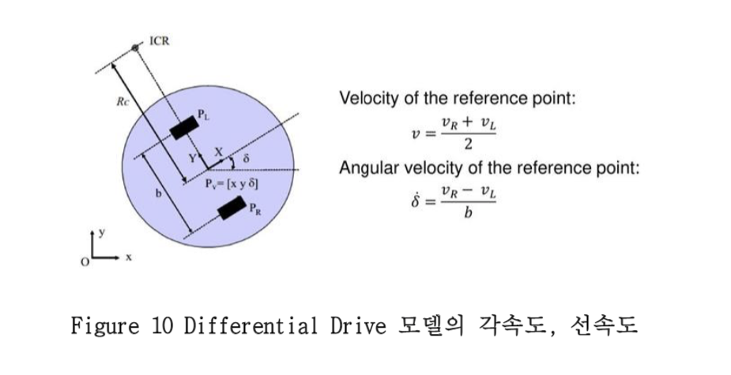
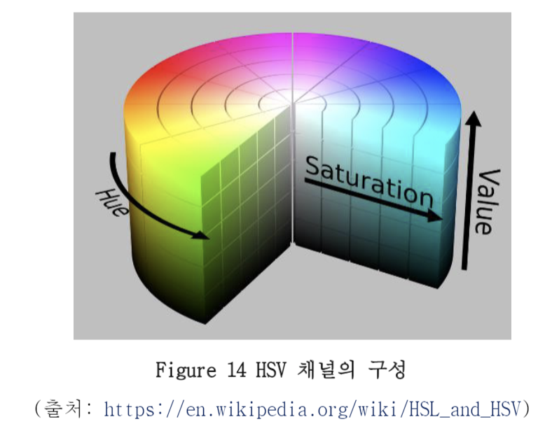
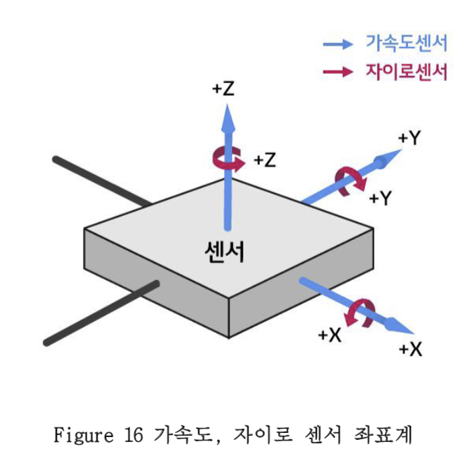
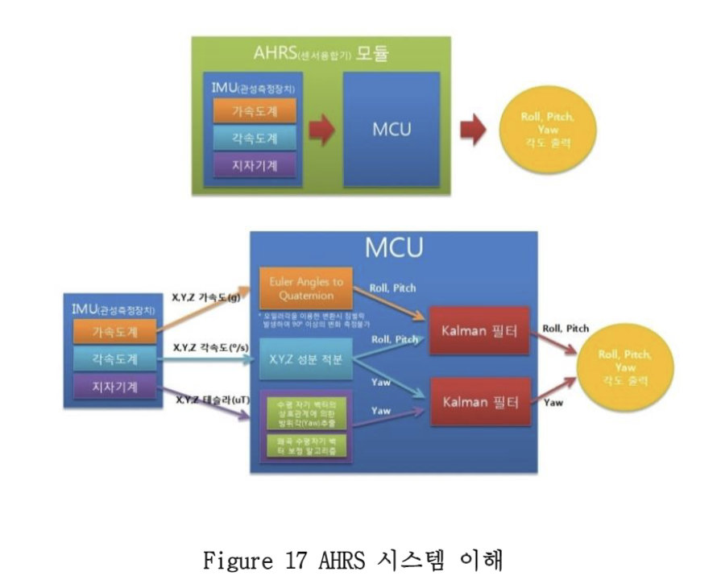
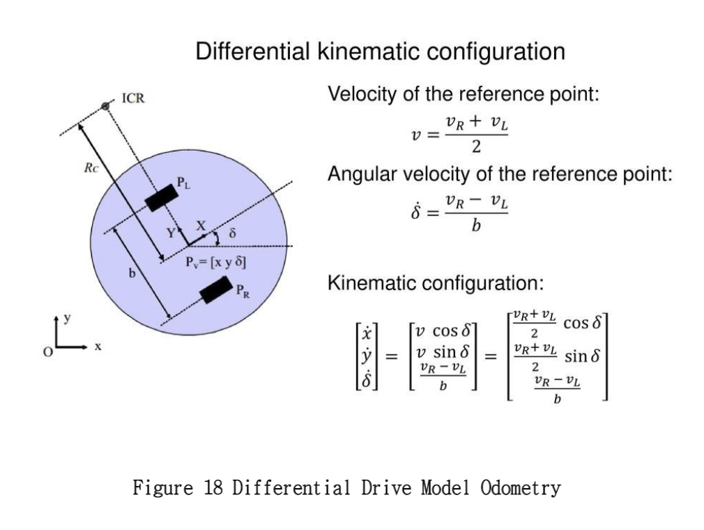
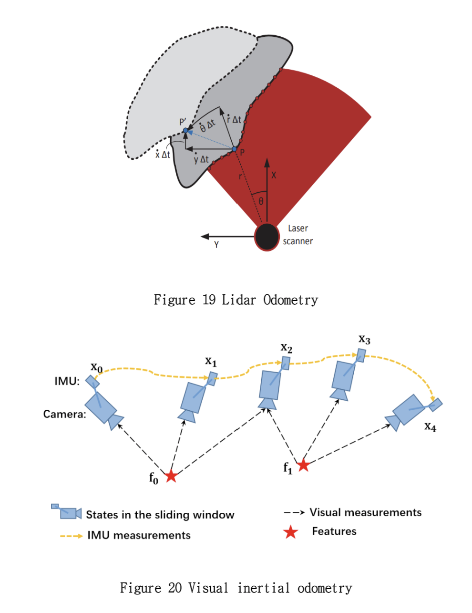
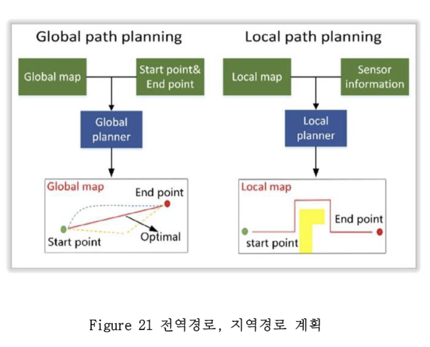

# 명세서 학습 요약

## 볼만한 튜토리얼 가이드

1. Creating a workspace: 패키지들과 기타 노드 파일들을 넣고 빌드하는 workspace에 대한 내용
2. Creating your first ROS2 package: 원하는 프로젝트에 대한 패키지를 생성하는 튜토리얼
3. Developing a ROS2 backage: 생성한 패키지의 setup.py에 대한 설명과, 실행 가능한 노드를 엔트리에 넣는 사항에 대한 내용
4. Writing a simple publisher and subscriber(Python): ROS2 topic 통신에 가장 기본적인 publisher--subscriber 노드들을 직접 만들어보고 통신시키는 내용
5. Creating custom ROS2 msg and srv files: 패키지에서 ROS2의 기본 메시지 외에 사용자가 직접 만들어서 사용하고자 하는 메시지를 customize하는 방법에 대한 내용
6. Expanding on ROS2 interfaces: 전용 인터페이스(메시지) 뿐만 아니라, 하나의 패키지에서 인터페이스를 전부 생성시켜 전역으로 사용하는 방법에 대한 내용.
7. Using colcon t build packages: colcon을 사용하여 만든 패키지를 빟드하는 방법.
8. Launching/monitoring multiple nodes with Launch: 여러 노드들을 묶어서 한번에 실행시키고자 하는 launch파일 작성법 및 실행법에 대한 튜토리얼
9. Using tf2 with ROS2: ROS1에도 쓰였던 좌표변환 메시지인 tf가 ROS2의 tf2으로 바뀌면서 , 이전과 달라진 좌표 변환 정보들을 송, 수신 방법 등을 간략하게 다루는 내용
10. Use the robot state publisher to publish joint states and TF: 각 로봇팔의 좌표변환 내용들을 로봇의 state과 같이 수신하여 rviz2에 어떻게 시각화하는지에 대한 데모
11. Turtlebot2 demo using ROS2: ROS2를 사용한 2차원 이동로봇 시뮬레이터 터틀봇2 데모
12. Movelt2 domo using ROS2: Ros2를 사용한 로봇팔 시뮬레이션 MoveIt2 데모

#### ROS2관련 링크

WIKI: https://index.ros.org/doc/ros2  
Tutorial: https://index.ros.org/doc/ros2/Tutorials

## Differential Drive

선속도와 각속도로 움직이기 때문에 조향장치 필요x 
제자리회전이 가능 --> 실내 서비스에 적용되는 제어 모델 

각속도는 오른쪽, 왼쪽 바퀴의 속도를 가지고 구할 수 있다.

#### Differential Drive 관련 링크
Differential Drive: https://enwikipedia.org/wiki/Dfferential_wheeled_robot  
학습 동영상: https://www.youtube.com/watch?v=aE7QNhwnPQ

## OpenCV

인텔에서 만든 오픈소스 영상처리 라이브러리 
Edge 검출, 흑백전환, 잡음제거를 간단하게 구현가능 
머신러닝 모델들 내장 --> 물체인식 구현가능

## Image 형식

Image는 대부분 height, width, channel 이렇게 세개의 dimension으로 이루어져 있다. 
Height, width : 세로, 가로 
Channel: 색의 표현 방식

RGB: red, green, blue 총 세개의 원색을 채널로 쓰는 방식. 
각각 0~255사이의 값을 가지고 있어 unsigned integer타입이다. 
Ex) red -> (255,0,0)

BGR: blue, green, red를 쓰는 방식 OpenCV는 BGR기준이다. 
때문에 RGB와 혼동 되지 않도록 작업에서 모니터링이 필요하다. 

GRAYSCALE: 흑백으로 이미지를 표현하는 채널 방식. 
1개의 채널에 0~255로 표현 
때문에 다른 채널의 이미지 Array와 같이 쓸때 주의가 필요하다. 

HSV: Hue(색조), Saturation(채도), Value(명도)로 구성된 채널. 
H로 색을 알 수 있기 때문에 직관적이다.

## Custom Object, Hand Control

<a href="/SSAFY 시뮬레이터 메뉴얼v5.pdf">SSAFY 시뮬레이터 메뉴얼v5.pdf</a> 

## IMU
관성센서라고 하며 Inertial Measurement Unit이다. 뉴턴의 제2법칙 관성을 만족하기 위해 가상으로 도입한 힘을 측정한다. 
가속도 센서, 자이로(각속도)센서로 이루어져 있다. 
가속도계와 각속도계는 서로 부족한 점을 보완할 수 있다. 
우리가 사용하는 로봇은 땅에만 있기 때문에 x, y, z(회전)만 고려하면 된다. 
3가지에 대한 자유도를 가지고 있어 3DOF(Degree of Freedom)이다. 
(비행기의 경우 6DOF) 
IMU만을 이용해서 로봇의 자세를 추정할 수 있지만 각속도, 가속도를 적분하여 사용하기 때문에 누적에러가 생긴다. 따라서 이번 프로젝트는 모터의 속도를 측정해서 얻은 선속도, 각속도 값을 같이 사용할 것이다. 

**가속도 센서**: 물체의 가속도와 진동, 충격 등 움직이는 힘을 측정하는 센서로 x, y, z방향의 가속도를 측정할 수 있다. 
변화하는 값의 오차가 누적되지는 않으나 노이즈와 이동, 진동에 취약하다. 
**자이로 센서**: 가속도만으로는 기울기를 정확하게 알 수 없어 사용한다. 
자이로 센서는 회전하는 물체의 각속도를 측정하는 센서이다. 
각도를 구하기 위해 전체 시간에 해당하는 만큼 적분을 통해 물체의 회전각과 기울기를 알 수 있다. 가속도에 비해 안정적인 값이 출력되지만 각도계산에서 적분으로 인하여 누적된 오차가 발생한다. 

MU 센서에서 가속도계, 각속도계, 지자기계를 사용해 부족한 점을 서로 보완하여 오일러각(roll, pitch, yaw)를 계산해주는 것을 AHRS라고 한다. 
**시뮬레이터의 IMU센서는 가속도, 각속도, Quaternion을 측정해서 알려준다. **
오일러각은 Quaternion으로 확장이 가능하며 Quaternion은 직관적이지는 않지만 짐벌락현상이 생기지 않으므로 컴퓨터 그래픽스에서 주로 사용한다. 
ROS2는 주로 Quaternion 형태로 메시지를 주고 받으므로 우리는 INU 센서를 통해 얻은 자세를 오일러각, Quaternion으로 변환하면서 사용해야 한다. 
변환은 squaternion을 사용한다.  
짐벌락현상: 오일러각을 이용해서 회전할 때 중심 축을 제외한 나머지 축들도 같이 회전을 하는데, 이때 2~3개의 축이 겹쳐서 1~2개의 축이 자유도를 잃어 회전할 수 없는 현상 

#### IMU 관련 링크

오일러각: http://ko.wikipedia.org/wiki/%EC%98%A4%EC%9D%BC%EB%9F%AC_%EA%B0%81  
Squaternion: https://pypi.org/project/squaternion  
IMU ros msg: http://docs.ros.org/en/melodic/api/sensor_msgs/html/msg/Imu.html  
IMU wiki: http://ko.wikipedia.org/wiki/%EA%B4%80%EC%84%B1_%EC%B8%A1%EC%A0%95_%EC%9E%A5%EB%B9%84

## 주행기록계
**주행기록계**: 주행한 기록 
이동한 거리를 추정이 가능하며 이는 로봇이 어떻게 이동했는지 추정할 수 있다는 것을 의미한다. 
주행을 시작한 위치를 기준으로하는 상대적 위치를 알 수 있다. 
Odometry를 계산하는 3가지 방법이 있다. 오차를 비교하고 가장 좋은 것을 사용권장 
1. 모터의 속도로 부터 얻은 각속도를 누적
2. IMU에서 측정한 각속도 누적
3. IMU에서 측정한 Quaternion을 이용하는 방법

Odometry는 또한 외부환경을 측정하는 센서(camera, Lidar)를 이용해 측정할 수도 있다. 
어떤 센서를 이용했는지에 따라 Visual Odometry, Lidar Odometry, Kinematic Odometry라고 부른다. 
이프로젝트에서는 Kinematic Odonmetry(모터의 속도)를 사용한다.

각 Odometry는 장단점이 있다.
### Kinematic
Kinematic를 이용하면 모터의 속도를 측정하기 때문에 지면과 마찰력, 모터의 공회전이 있으면 에러가 계속 누적이 되어 부정확하다. 
특히 공회전은 회전할 때 주로 일어나므로 에러는 더욱 커지게 된다. 
이때 Imu센서에서 측정된 각속도 혹은 Quaternion을 이용하여 에러를 보정할 수 있다.

### Lidar
세선에 찍히는 포인트들이 다양하고 여러 특징을 가지고 있어야 한다. 
카메라도 이와 비슷하게 feature가 많이 추출되는 환경에서 잘 작동한다. 따라서 Visual Odometry는 camera와 IMU를 함께 사용한다.

#### Odometry 관련 링크
Kinematics: https://en.wikipedia.org/wiki/Kinematics  
Visual Odometry: https://en.wikipedia.org/wiki/Visual_odometry  
Odometry Youtube: https://www.youtube.com/watch?v=LrsTBWf6Wsc

## 경로
SUB1은 로봇이 주행한 기록을 똑같이 저장할 수 있도록 주행 기록계기반의 경로를 만드는 방법을 사용한다. 이 방법은 가장 쉽게 경로를 구현하고 테스트 할 수 있다. 
하지만 항상 목적지가 고정되어 있다.

