[TOC]

# 2. 외부 서비스

## Naver Cloud SENS Service (Simple & Easy Notification Service)

### 1. 네이버 클라우드 로그인 후 결제 수단 등록

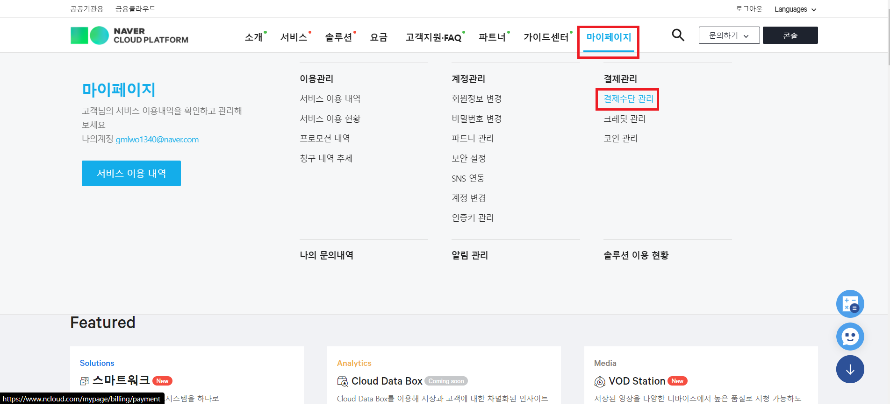
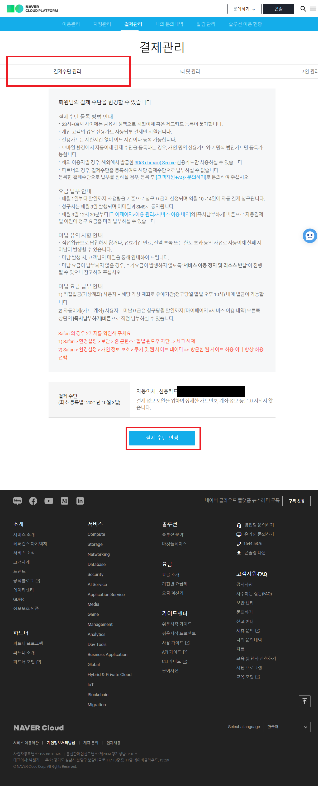

- 먼저 네이버 클라우드 서비스 이용을 위해 결제 수단을 등록해야합니다.

### 2. API 인증 키 생성 및 조회

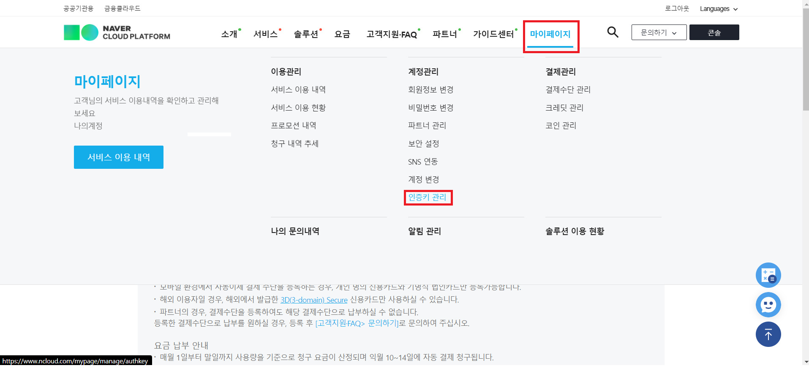
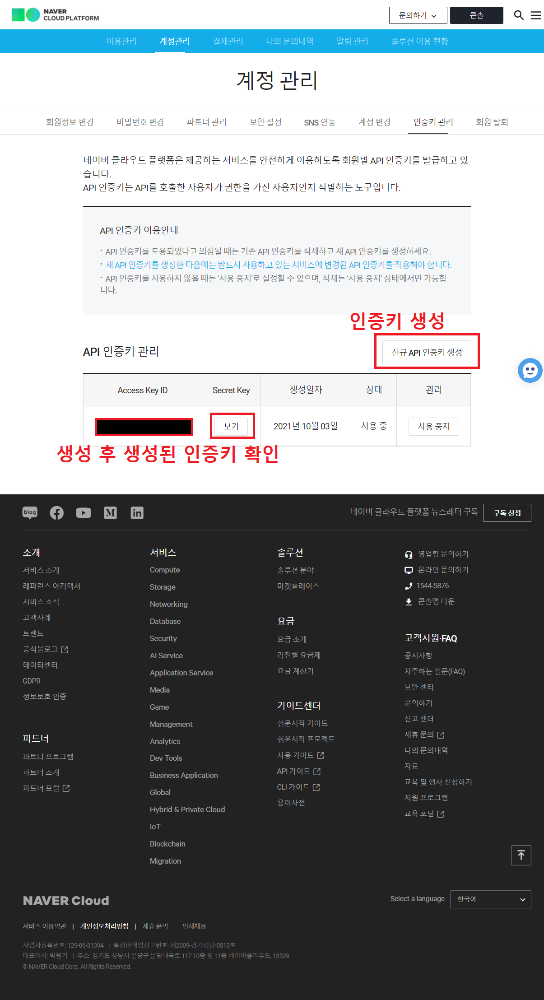

- 네이버 클라우드의 API 이용을 위한 인증키를 발급

### 3. SENS 프로젝트 생성

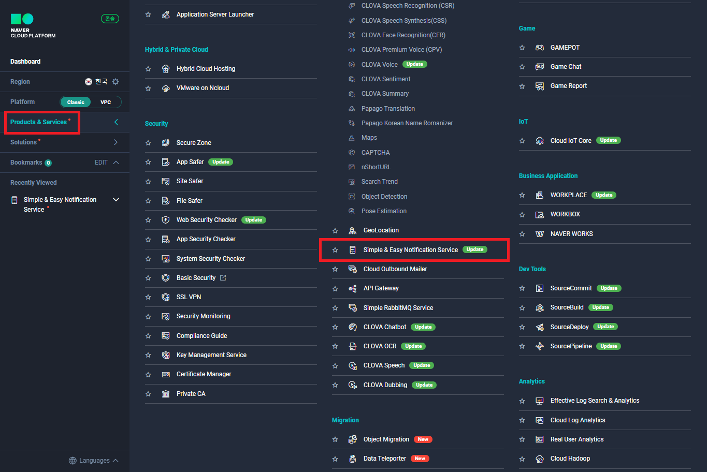
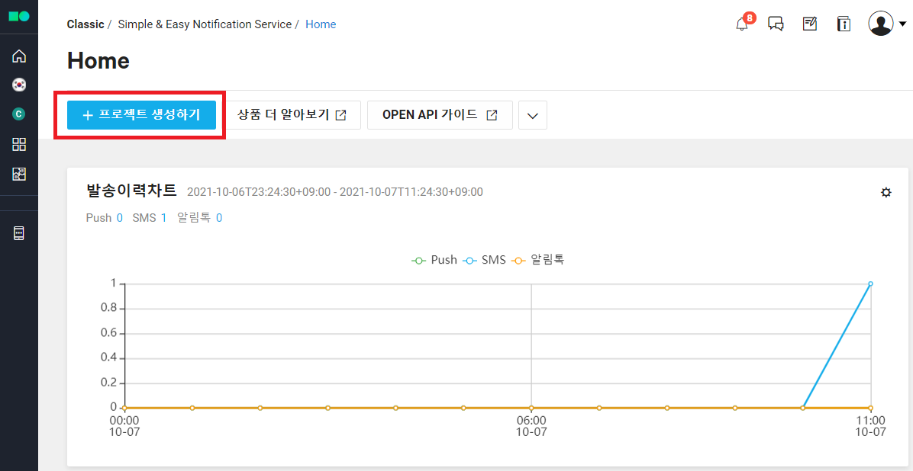
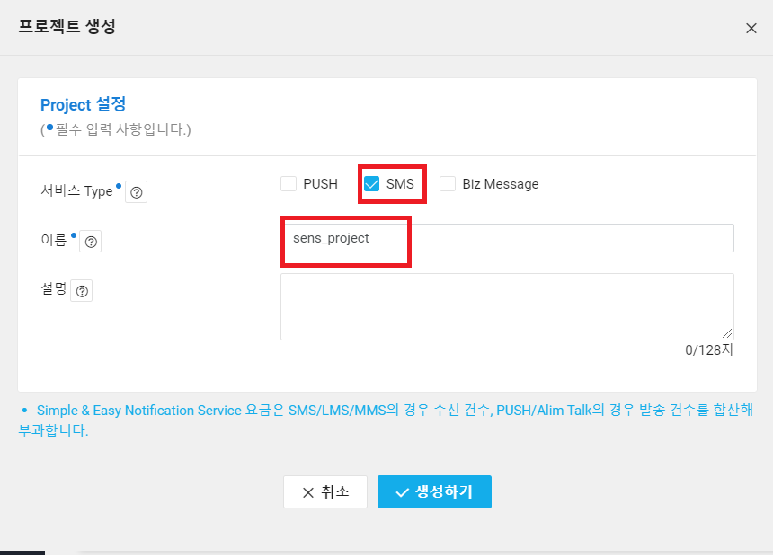
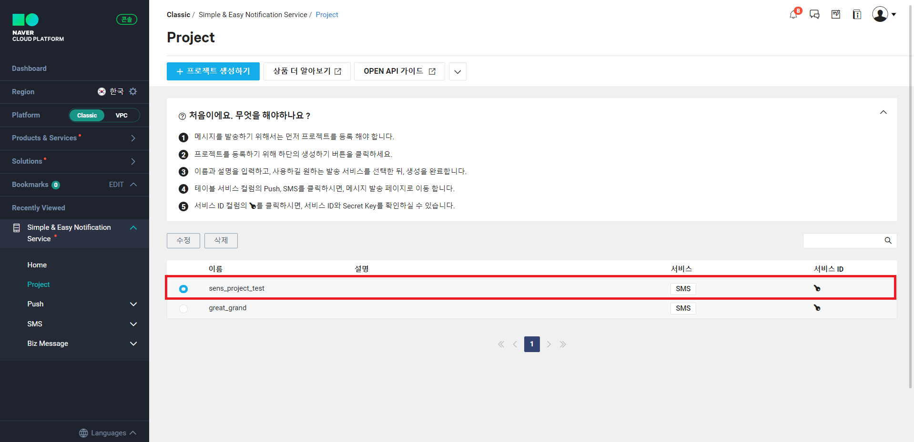

- 콘솔창에서 SENS 서비스 이용을 위해서 프로젝트를 생성합니다.

### 4. 발송 번호 등록

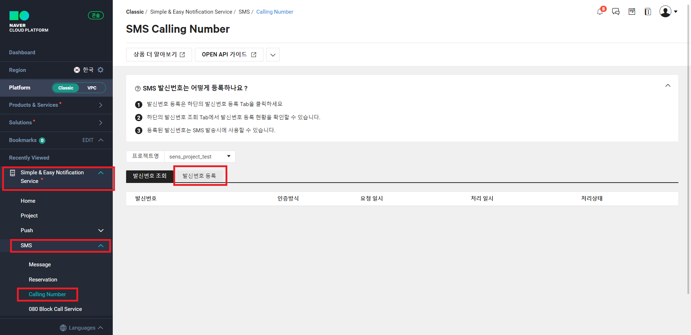
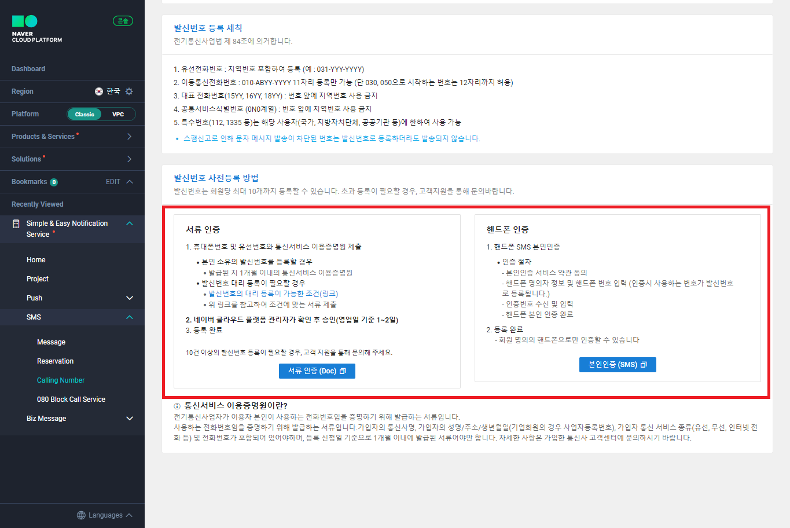

- 또한 SMS 전송을 위해 사용할 번호의 인증을 진행합니다.

### 5. 코드 수정

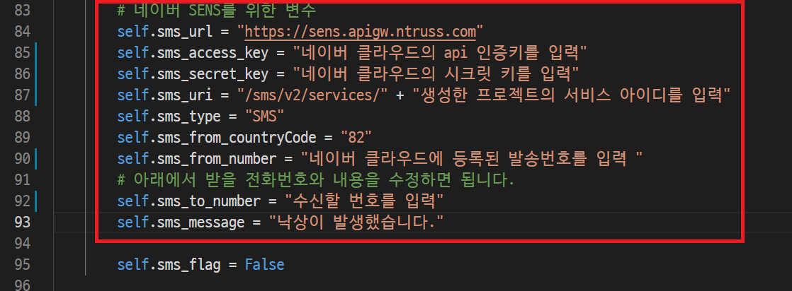

- 마지막으로 발급한 api 키로 코드를 교체해줍니다.
- 이 과정을 마치면 낙상후 SMS를 전송하는 서비스를 이용할 수 있습니다.