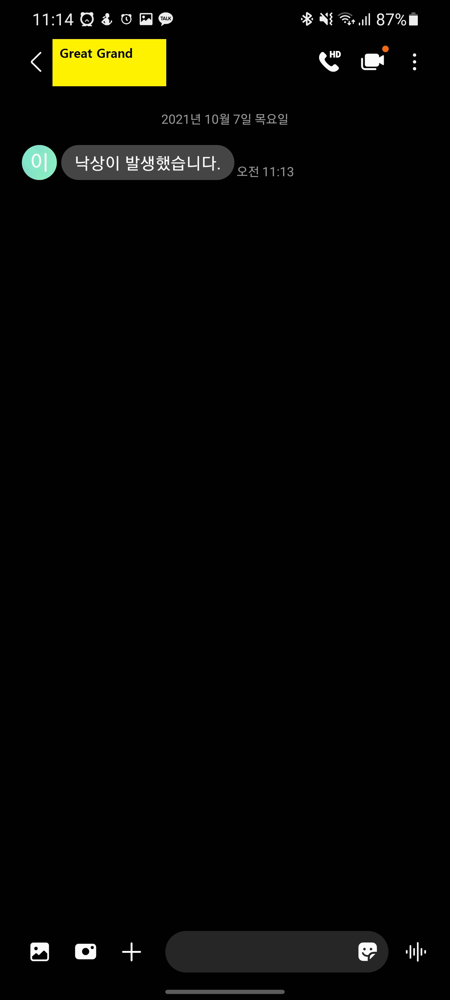

[TOC]

# 4. 시연 시나리오

## Web

### 1. 메인페이지

- Great Grand가 어떤 서비스를 제공하는 지에 대한 간략한 정보 제공
- 로그인 로그아웃 기능은 미구현

### 2. 터틀봇 제어 페이지

- 자율 주행 및 수동 주행 모드 선택 가능
- 웹을 통한 수동 주행은 미구현
- 웹을 통해서 집 안의 IoT 기기 제어 가능
- 시간, 온도, 날씨와 같은 정보 확인 가능

### 3. 사용자 인식

- OpenCV를 통한 Facial-Recognition API를 이용하여 사용자를 등록하고 인식할 수 있음

### 4. 낙상 감지

- 터틀봇 카메라를 통해 낙상을 감지
- 감지한 데이터를 토대로 낙상 여부에 따라 보호자에게 SMS 문자메시지 전송